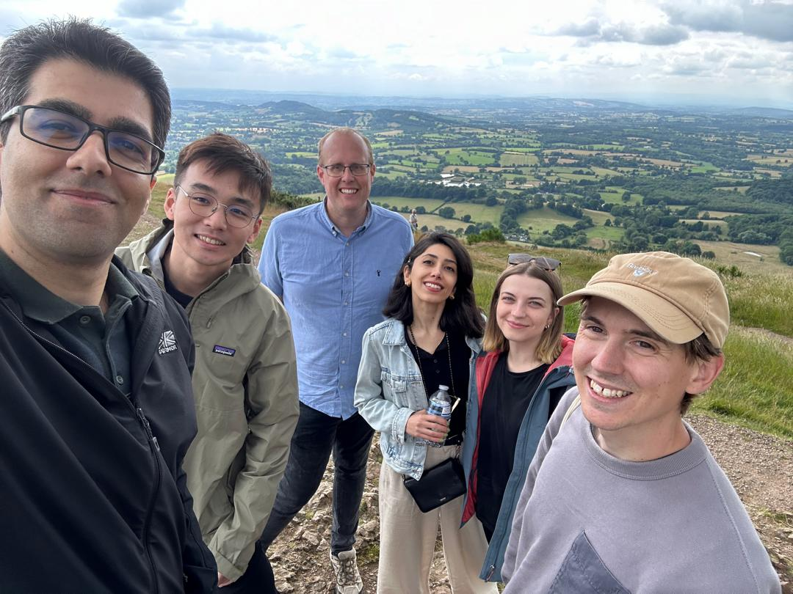
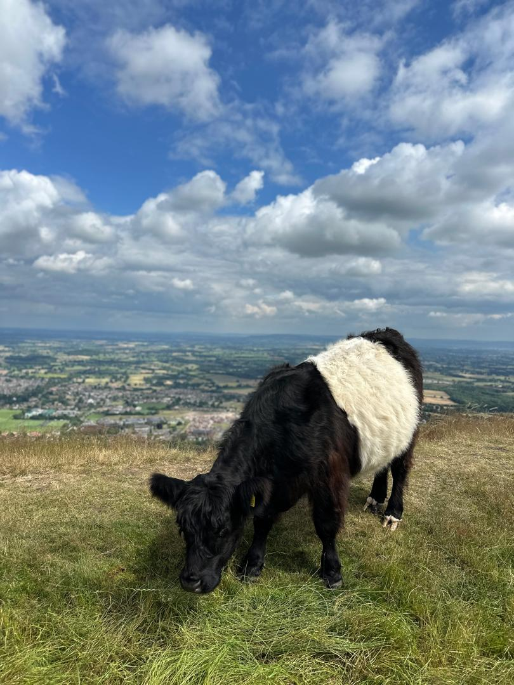
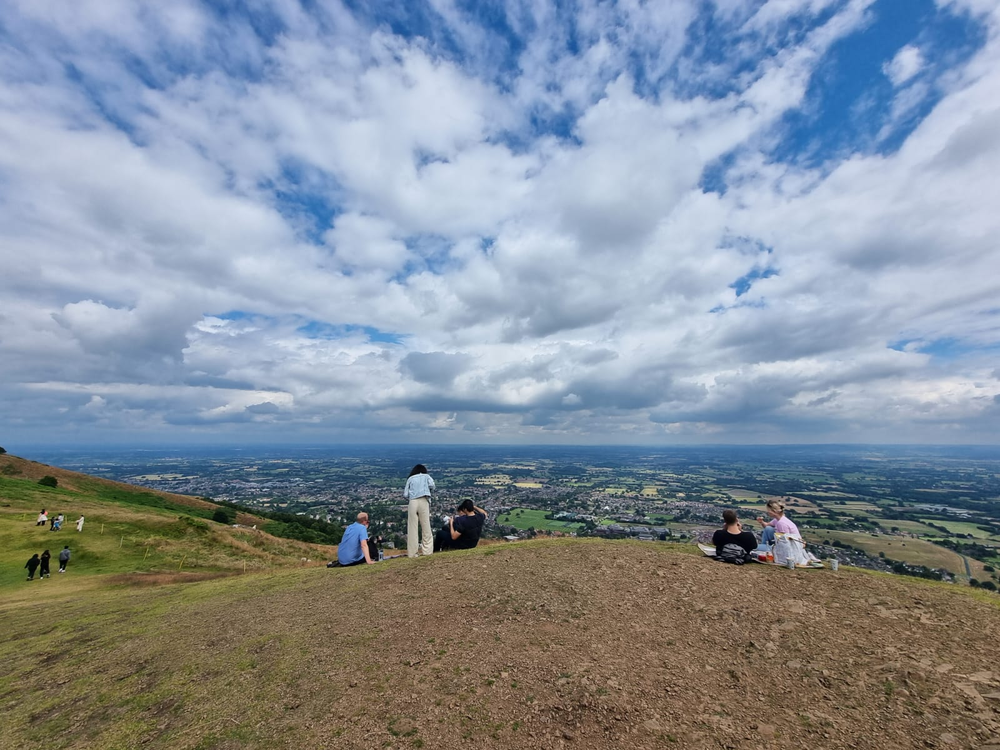
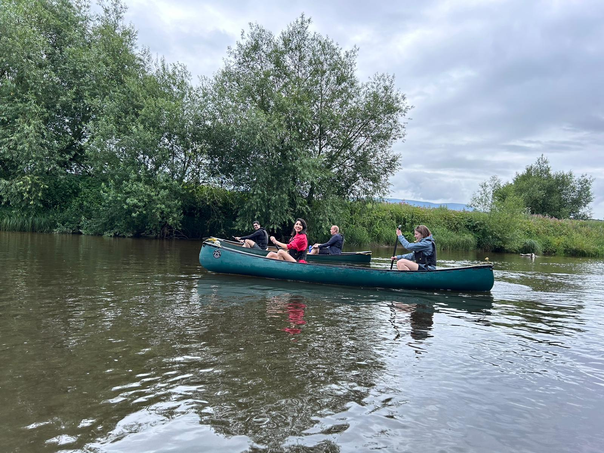
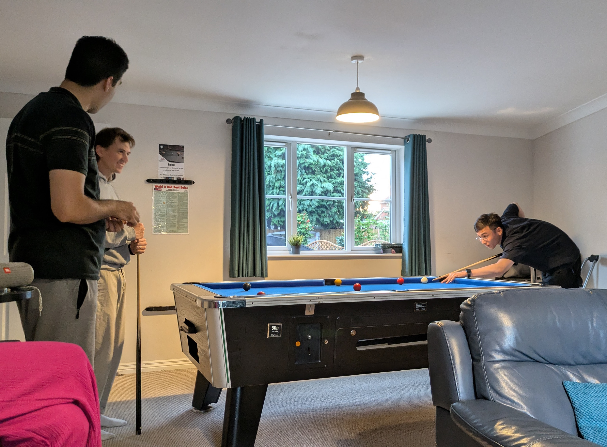

<!DOCTYPE html>
<html lang="en">
<head>
    <meta charset="UTF-8">
    <meta name="viewport" content="width=device-width, initial-scale=1.0">
    <title>Image Gallery</title>
    
</head>
<body>
    <h1>Image Gallery</h1>
    
For the Gilbertine Lab, weekend away 2024, we headed to Hereford to sample the river Wye, through a day of canoeing

    

        

            
            
The weekend Logo

        

        

            
            
On top of the Malvern Hills

        

        

            
            
A cow

        

        

            
            
Pretty view of Malven Hills

        

        

            
            
Conaling on the River Wye

        

        

            
            
Ed and Xu

        

        

            
            
Caption for Image 6

        

        

            
            
Caption for Image 8

        

        

            
            
Caption for Image 9

        

        

            
            
Shedgh and Ed playing Pool

        

        

            
            
Caption for Image 11

        

        

            
            
Caption for Image 12

        

        

            
            
Caption for Image 13

        

        

            
            
Caption for Image 14

        

        

            
            
Caption for Image 15

        

    

    
Thank you for visiting the gallery!

</body>
</html>